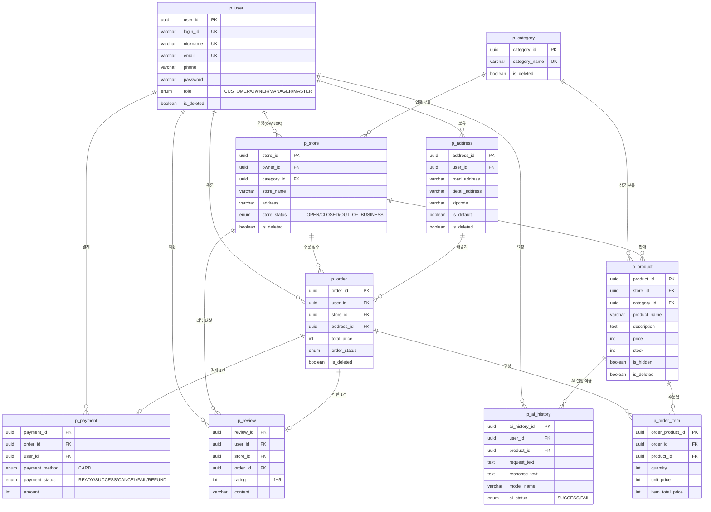
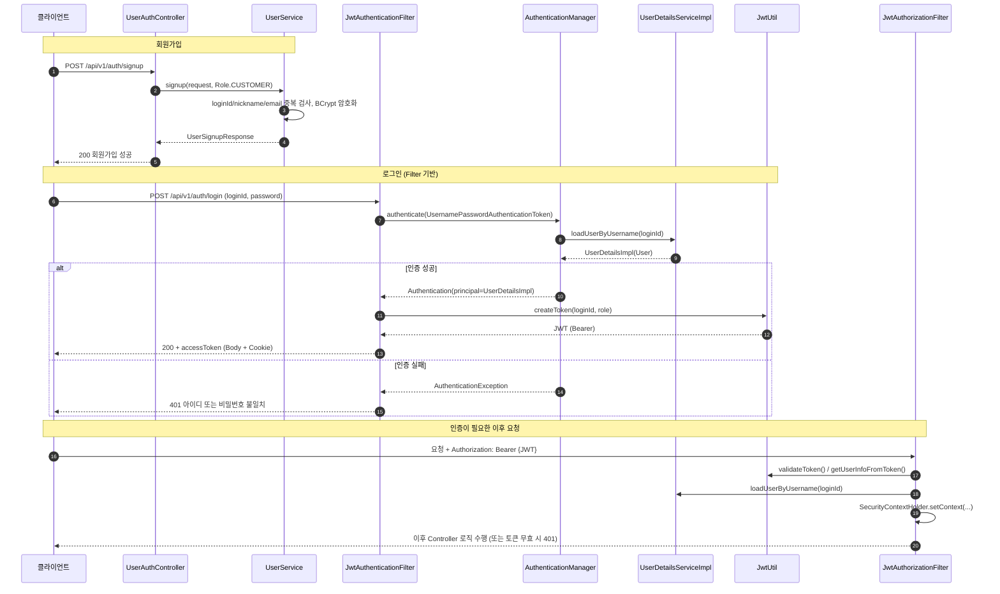
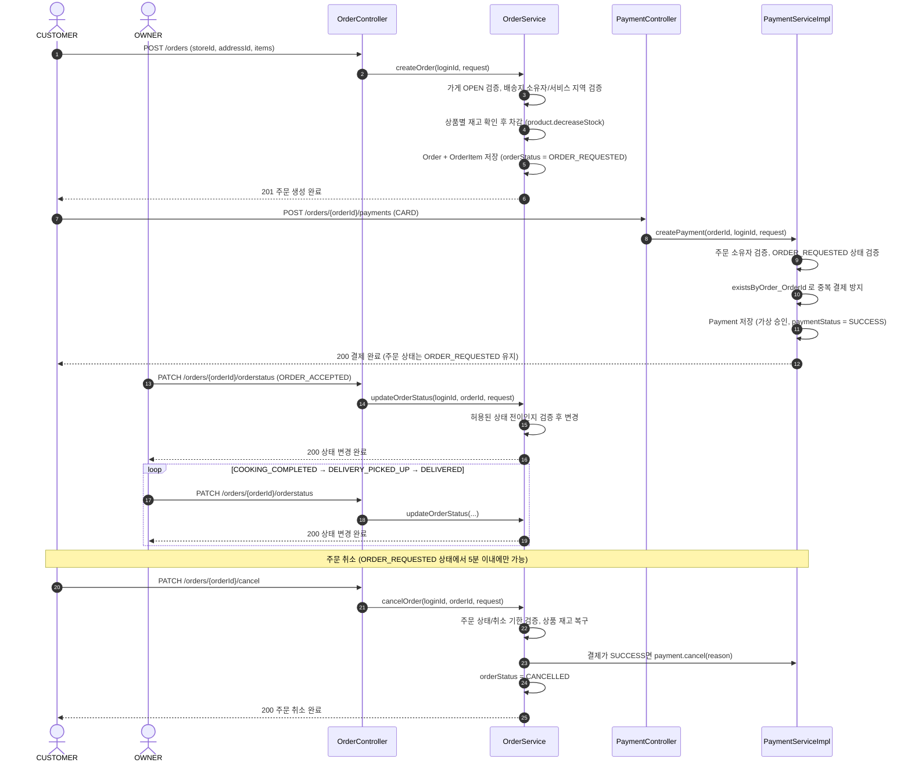
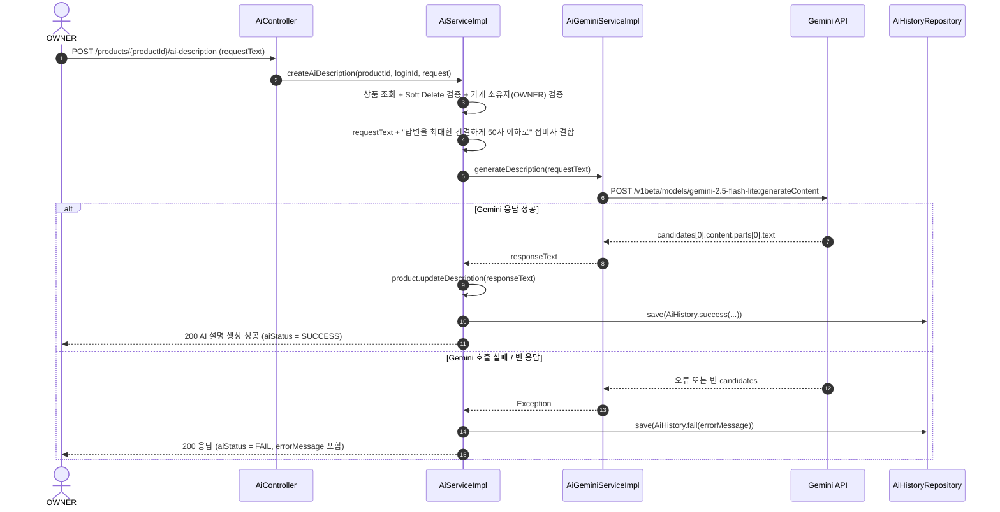

# 저기요 (jeogi-yo)

[](https://openjdk.org/)
[](https://spring.io/projects/spring-boot)
[](https://www.postgresql.org/)
[](https://spring.io/projects/spring-security)
[](https://www.docker.com/)
[](https://ai.google.dev/)

> AI가 상품 설명 작성을 도와주는 **광화문 지역 음식점 배달 서비스**

---

## 목차

- [팀원 소개](#팀원-소개)
- [프로젝트 소개](#프로젝트-소개)
- [서비스 구성 및 실행 방법](#서비스-구성-및-실행-방법)
- [ERD](#erd)
- [시퀀스 다이어그램](#시퀀스-다이어그램)
- [기술 스택](#기술-스택)
- [API 설계](#api-설계)
- [구현 상세](#구현-상세)
- [프로젝트 회고](#프로젝트-회고)
- [소감](#소감)
- [팀 문서](#팀-문서)

---

## 팀원 소개

| 이름       | 담당 파트                                             |
|----------|---------------------------------------------------|
| 차은지 (팀장) | 가게(Store) + 상품(Product) + AI 연동 + 결제(Payment)     |
| 진혜림      | 공통 (Spring Security, JWT, BaseEntity, CommonResponse, 공통 예외 처리) |
| 서주성      | 회원(User) + 배송지(Address)                           |
| 권순혁      | 주문(Order) + 주문상품(OrderItem)                       |
| 서준영      | 카테고리(Category) + 리뷰(Review)                       |

---

## 프로젝트 소개

### 한 줄 요약

**저기요**는 광화문 인근 음식점을 대상으로 한 배달 주문 플랫폼입니다. 고객은 가게·상품을 검색해 주문하고 결제·리뷰까지 남길 수 있으며, 점주는 Google Gemini API를 활용해 상품 설명을 자동으로 생성할 수 있습니다.

### 만들게 된 배경 / 목적

- 배달 서비스의 핵심 흐름(회원가입 → 가게/상품 탐색 → 주문 → 결제 → 리뷰)을 하나의 모놀리식 서비스로 직접 설계하고 구현하며 **도메인 모델링과 REST API 설계 역량**을 키우고자 기획했습니다.
- 점주가 상품을 등록할 때 설명 문구 작성에 드는 시간을 줄이기 위해 **Gemini API 기반 AI 상품 설명 생성 기능**을 도입하고, 모든 요청/응답 이력을 `p_ai_history`에 감사(audit) 로그로 남기도록 설계했습니다.
- 실서비스 운영을 가정해 **Soft Delete, 페이징/정렬 공통 규칙, 역할(Role) 기반 접근 제어** 등 실무에서 요구되는 데이터 정합성·보안 규칙을 API 명세 단계부터 촘촘히 정의했습니다.
- 서비스 범위는 전국 확장을 염두에 두고 설계하되, 1차 개발 단계에서는 **광화문 인근 지역**으로 주문 가능 지역을 한정했습니다.

### 프로젝트 상세

| 항목 | 내용                                                                  |
|---|---------------------------------------------------------------------|
| 프로젝트명 | 저기요 (jeogi-yo)                                                      |
| 형태 | Backend 단일 모놀리식 서비스 (Spring Boot)                                   |
| 대상 지역 | 광화문 인근 (배송지·가게 등록 시 지역 검증)                                          |
| 사용자 역할 | `CUSTOMER`(고객), `OWNER`(점주), `MASTER`(최종 관리자), `MANAGER`(일반 관리자 - 추후 확장 예정) |
| 핵심 도메인 | 회원, 배송지, 카테고리, 가게, 상품, 주문/주문상품, 결제, 리뷰, AI 응답 이력                    |
| AI 연동 | Google AI Studio — Gemini 2.5 Flash-Lite (상품 설명 자동 생성)              |
| 개발 기간 | 2026.07                                                             |

---

## 서비스 구성 및 실행 방법

### 배포 흐름 (CI/CD → AWS EC2)

```
1. git push → 2. Docker build → 3. Docker push(Docker Hub) → 4. Docker pull(EC2) → 5. docker compose up
```

```bash
# 1. 로컬/CI에서 이미지 빌드 및 푸시
docker build -t <dockerhub-id>/jeogi-yo:latest .
docker push <dockerhub-id>/jeogi-yo:latest

# 2. EC2(Ubuntu)에서 이미지 pull 후 기동
docker pull <dockerhub-id>/jeogi-yo:latest
docker compose up -d
```

EC2 위에서 Docker Compose가 Spring Boot 컨테이너와 PostgreSQL 컨테이너를 함께 기동하며, 애플리케이션 로그(Spring Boot Log)와 서버 상태(CPU/메모리/디스크)를 통해 운영 상태를 모니터링합니다.

| 구분 | 프로토콜 | 포트 | 설명 |
|---|:---:|:---:|---|
| 클라이언트 → EC2 | HTTPS | 443 | 웹/모바일 → Spring Boot API |
| EC2 → PostgreSQL | TCP (JDBC) | 5432 | 애플리케이션 → DB |
| EC2 → Gemini API | HTTPS | 443 | AI 상품 설명 요청 |
| SSH 접속 (관리자) | SSH | 22 | EC2 서버 접속 |

### 사전 요구사항

| 항목 | 버전 |
|---|---|
| Java | 17 |
| PostgreSQL | 17.10 |
| Gradle | Wrapper 포함 (`./gradlew`) |
| (배포 시) Docker / Docker Compose | 최신 |

### 로컬 실행 방법

**1. 저장소 클론**

```bash
git clone https://github.com/Georgia-team/jeogi-yo.git
cd jeogi-yo
```

**2. 환경 변수 설정**

프로젝트 경로에 `.env` 파일을 생성합니다. `DB_USERNAME`/`DB_PASSWORD`, `GEMINI_API_KEY`, `SECURITY_JWT_SECRET`을 실제 값으로 채우는 방법은 바로 아래 2-1 ~ 2-3 단계를 참고하세요.

```env
DB_USERNAME=postgres
DB_PASSWORD=your_db_password
SECURITY_JWT_SECRET=위에서-생성한-Base64-문자열
GEMINI_API_KEY=your_gemini_api_key
```

**2-1. PostgreSQL 데이터베이스 준비**

로컬에 설치된 PostgreSQL에 접속해 데이터베이스를 생성합니다.

```sql
CREATE DATABASE delivery_db;
```
* PostgreSQL의 별도의 username, password가 필요합니다.
> [PostgreSQL 연동 가이드](https://app.notion.com/p/team-georgia-pjt-dtl/PostgreSQL-395a26d65cda8040b426ce6e5b57a4d5)를 참고하실 수 있습니다.

**2-2. GEMINI_API_KEY 발급받기**

1. [Google AI Studio API 키 페이지](https://aistudio.google.com/apikey)에 접속해 Google 계정으로 로그인합니다.
2. **API 키 만들기(Create API key)** 버튼을 클릭합니다.
3. 생성된 키를 복사해 위 `.env`의 `GEMINI_API_KEY` 값으로 붙여넣습니다.

> [Gemini API 키 가이드](https://ai.google.dev/gemini-api/docs/api-key?hl=ko)를 참고하실 수 있습니다.

**2-3. SECURITY_JWT_SECRET 생성하기**

`JwtUtil`은 `SECURITY_JWT_SECRET` 값을 Base64로 디코딩해 HS256 서명 키로 사용합니다(`Keys.hmacShaKeyFor`). HS256은 최소 256비트(32바이트) 이상의 키가 필요하므로, 임의의 문자열이 아니라 **충분한 길이의 무작위 바이트를 Base64로 인코딩한 값**을 사용해야 합니다. 아래 중 편한 방법으로 생성하세요.

- **macOS / Linux / Git Bash (Windows)**

  ```bash
  openssl rand -base64 64
  ```

- **Windows PowerShell**

  ```powershell
  [Convert]::ToBase64String([System.Security.Cryptography.RandomNumberGenerator]::GetBytes(64))
  ```

- **Python (OS 무관)**

  ```bash
  python -c "import secrets, base64; print(base64.b64encode(secrets.token_bytes(64)).decode())"
  ```

출력된 Base64 문자열을 그대로 복사해 위 `.env`의 `SECURITY_JWT_SECRET` 값으로 사용합니다. (64바이트 기준 예시일 뿐이며, 32바이트 이상이면 가능합니다.)

**3. 애플리케이션 실행**

```bash
./gradlew bootRun
```

서버 기동 후 Swagger UI: `http://localhost:8080/swagger-ui/index.html`

> `src/main/resources/application.yml`은 기본적으로 `jdbc:postgresql://localhost:5432/delivery_db`를 바라보도록 설정되어 있으며, `spring.jpa.hibernate.ddl-auto=create`로 기동 시 테이블이 자동 생성됩니다.

---

## ERD



> 모든 테이블은 `created_at/by`, `updated_at/by`, `is_deleted`, `deleted_at/by`를 공통으로 가지며, 실제 삭제 대신 **Soft Delete**를 사용합니다. 일반 조회는 `is_deleted = false` 조건이 기본 적용됩니다.

### 테이블 목록 (총 10개)

| 도메인 | 테이블 | 설명 |
|---|---|---|
| 회원 | `p_user` | 회원 기본 정보 (CUSTOMER/OWNER/MANAGER/MASTER) |
| 회원 | `p_address` | 배송지 (사용자당 기본 배송지 1개) |
| 상품 분류 | `p_category` | 가게 업종·상품 분류 공통 카테고리 |
| 가게 | `p_store` | 점주가 등록한 가게 |
| 상품 | `p_product` | 가게별 판매 상품 |
| 주문 | `p_order` | 주문 (주문 시점 배송지 스냅샷 포함) |
| 주문 | `p_order_item` | 주문에 포함된 상품 및 수량/금액 |
| 결제 | `p_payment` | 주문 1건당 결제 1건 |
| 리뷰 | `p_review` | 주문 1건당 리뷰 1개 |
| AI | `p_ai_history` | Gemini API 요청/응답 이력 |

---

## 시퀀스 다이어그램

### 1. 회원가입 & 로그인 (JWT 발급/검증)

로그인은 별도 컨트롤러 대신 JwtAuthenticationFilter가 Spring Security 필터 체인에서 처리하고,
이후 요청은 JwtAuthorizationFilter가 JWT를 검증해 인증 정보를 SecurityContext에 등록합니다.



### 2. 주문 생성 → 결제 → 주문 상태 변경

> 관련 상세 내용: [구현 상세  7. 주문 - 결제 상태 관리](#7-주문---결제-상태-관리)



### 3. AI 상품 설명 생성 (Gemini 연동)

AI 요청이 실패해도 예외를 그대로 던지지 않고 `p_ai_history`에 `FAIL` 이력을 저장한 뒤 `200 OK` + `aiStatus: FAIL` 형태로 응답합니다. 클라이언트는 HTTP 상태 코드가 아니라 응답 바디의 `aiStatus` 값으로 성공/실패를 판단해야 합니다.



---

## 기술 스택

| 구분 | 기술 |
|---|---|
| Backend | Spring Boot 3.5 |
| Language | Java 17 |
| Database | PostgreSQL 17.10 |
| ORM | Spring Data JPA / Hibernate, QueryDSL |
| Security | Spring Security + JWT |
| API 문서 | springdoc-openapi (Swagger UI) |
| API 테스트 | Postman |
| AI | Google AI Studio — Gemini API (2.5 Flash-Lite) |
| Container | Docker / Docker Compose |
| Cloud | AWS EC2 (Ubuntu) |
| 형상 관리 | Git / GitHub |

---

## API 설계

### 공통 규칙

- Base URL: `/api/v1`
- 인증: `Authorization: Bearer {JWT}` (로그인 필요 API에 적용)
- 권한(Role): `CUSTOMER`, `OWNER`, `MASTER` (`MANAGER`는 확장 범위로 제외)
- 공통 응답 포맷

  ```json
  {
    "success": true,
    "data": { },
    "message": "string"
  }
  ```

- 페이징: `page` 기본 0, `size`는 10/30/50만 허용(그 외 값은 10), 기본 정렬은 `created_at desc`
- 삭제는 전부 Soft Delete이며, 삭제 시 서버가 `is_deleted`, `deleted_at`, `deleted_by`를 직접 관리 (요청 바디로 받지 않음)
- HTTP 상태 코드: `200`(조회/수정) · `201`(생성) · `400`(검증 실패) · `401`(인증 필요) · `403`(권한 없음) · `404`(리소스 없음) · `409`(중복/규칙 위반) · `500`(서버 오류)

### 도메인별 엔드포인트 개요

| 도메인 | 기본 경로 | 주요 기능 | 권한 |
|---|---|---|---|
| 회원 | `/auth`, `/users` | 회원가입, 로그인(JWT 발급), 내 정보 조회/수정/탈퇴, 회원 검색 | 전체 / MASTER(검색) |
| 배송지 | `/addresses` | 등록·조회·목록·수정·삭제, 기본 배송지 1개 제한 | CUSTOMER |
| 카테고리 | `/categories` | 등록·조회·검색·수정·삭제 (가게/상품 공용 분류) | MASTER(변경) / 전체(조회) |
| 가게 | `/stores` | 등록, 상세/목록 조회, 정보 수정, 영업 상태 변경, 삭제 | OWNER / MASTER |
| 상품 | `/stores/{storeId}/products`, `/products` | 등록(AI 설명 생성 옵션 포함), 조회/검색, 수정, 삭제 | OWNER / MASTER |
| 주문 · 주문상품 | `/orders`, `/stores/{storeId}/orders` | 주문 생성, 상세/목록 조회, 가게별 목록, 상태 변경, 취소 | CUSTOMER / OWNER / MASTER |
| 결제 | `/orders/{orderId}/payments`, `/payments` | 결제 생성(가상 승인), 조회/검색, 취소, 이력 삭제 | CUSTOMER / MASTER |
| 리뷰 | `/orders/{orderId}/reviews`, `/reviews`, `/stores/{storeId}/reviews` | 작성(배송 완료 주문만), 조회/검색, 수정, 삭제 | CUSTOMER / MASTER |
| AI 응답 이력 | `/products/{productId}/ai-description`, `/ai-histories` | Gemini 기반 상품 설명 생성 + 이력 저장/조회/검색 | OWNER(생성) / MASTER(조회) |

주문 상태는 `ORDER_REQUESTED → ORDER_ACCEPTED/ORDER_REJECTED → COOKING_COMPLETED → DELIVERY_PICKED_UP → DELIVERED`(또는 `CANCELLED`) 순으로 전이되며, 각 전이는 요청자의 권한(CUSTOMER/OWNER)에 따라 허용 범위가 다릅니다. 상세 요청/응답 필드와 비즈니스 규칙은 팀 API 명세 문서를 참고하세요.

전체 요청/응답 예시와 필드별 비즈니스 규칙은 서버 기동 후 Swagger UI(`/swagger-ui/index.html`)에서 확인할 수 있습니다.

---

## 구현 상세

### 1. 주요 구현 기능

| 주제 | 기능 / 핵심 내용 | 설명 |
|---|---|---|
| 회원 | 회원가입, 로그인, 내 정보 조회, 회원 수정, 회원 탈퇴, 회원 목록 검색 | JWT 인증 기반으로 로그인 사용자를 식별하고, MASTER는 회원 목록을 조건별로 조회 가능 |
| 관리자 기능 | 회원 목록, 카테고리 관리, AI 이력 관리, 결제 이력 관리 | MASTER 권한으로 운영 관리성 데이터를 조회하고 관리 가능 |
| 배송지 | 배송지 등록, 수정, 삭제, 상세 조회, 목록 조회 | 사용자별 배송지를 관리하고, 주문 생성 시 배송지 정보를 주문상세에 스냅샷으로 저장 |
| 카테고리 | 카테고리 등록, 상세 조회, 검색, 수정, 삭제 | MASTER가 카테고리를 관리하고, 가게/상품 등록 시 카테고리 참조 |
| 가게 | 가게 등록, 상세 조회, 검색, 수정, 상태 변경, 삭제 | OWNER가 본인 가게를 관리하고, CUSTOMER/OWNER/MASTER는 가게 조회 및 검색 가능 |
| 상품 | 상품 등록, 상세 조회, 검색, 수정, 삭제, 숨김 상품 처리 | OWNER는 본인 가게 상품을 관리, CUSTOMER는 숨김 처리되지 않은 상품만 조회 |
| AI | Gemini 기반 상품 설명 생성, AI 이력 상세 조회, AI 이력 검색 | OWNER가 상품 설명을 AI로 생성, MASTER가 AI 응답 이력을 조회/검색 |
| 주문 | 주문 생성, 상세 조회, 주문 목록 검색, 가게별 주문 검색, 상태 변경, 주문 취소 | 주문 생성 시 재고를 차감, 주문 취소 시 재고를 복구 |
| 결제 | 결제 생성, 상세 조회, 목록 검색, 결제 취소, 결제 이력 삭제 | 주문 단위로 결제를 생성하고, 결제 취소 시 주문 취소와 연동해 주문-결제 상태 정합성을 유지 |
| 리뷰 | 리뷰 등록, 상세 조회, 가게별 리뷰 검색, 수정, 삭제 | 배송 완료된 주문을 기준으로 리뷰 작성 가능 여부와 중복 리뷰를 검증 |

### 2. 기술 적용 내용

| 기술 | 적용 내용 | 설명 |
|---|---|---|
| Spring Security | 인증/인가 구조 구성 | JWT 필터와 SecurityConfig를 통해 API 접근 제어 |
| JWT | Access Token 발급 및 검증 | 로그인 성공 시 토큰을 발급하고, 요청마다 토큰을 검증 |
| BCrypt | 비밀번호 암호화 | 회원가입 시 비밀번호를 암호화하여 저장 |
| `@PreAuthorize` | 역할 기반 접근 제어 | Controller 진입 단계에서 CUSTOMER/OWNER/MASTER 권한 검증 |
| `@AuthenticationPrincipal` | 로그인 사용자 추출 | 요청 파라미터가 아닌 인증 객체에서 로그인 사용자의 `loginId` 추출 |
| JPA / Hibernate | Entity 매핑, 연관관계, UUID PK | ERD 기준으로 Entity를 구성하고 UUID 식별자 사용 |
| QueryDSL | 동적 검색 조건 처리 | 검색 조건이 다양한 목록 API에서 조건 조합, 페이징, 정렬 처리 |
| JPA Auditing | 생성/수정 시간 자동 기록 | `createdAt`, `updatedAt` 같은 공통 이력 자동 관리 |
| CommonResponse | API 응답 포맷 통일 | 성공 여부, 메시지, 데이터를 동일 구조로 응답 |
| PageResponse / PageUtil | 페이지 응답 및 요청 보정 | 목록 검색 응답 구조와 page/size/sort 처리 통일 |
| Swagger | API 문서 및 인증 테스트 | Bearer Token 인증을 적용해 Swagger에서 API 테스트 가능 |
| JUnit / Mockito | 단위 테스트 | 권한, 상태 변경, 실패 케이스, 페이지 처리 검증 |

### 3. 보안 및 권한 설계

| 항목 | 적용 내용 | 설명 |
|---|---|---|
| 인증 기준 | JWT 기반 인증 | 세션이 아닌 Access Token으로 로그인 상태 확인 |
| 사용자 식별 | loginId를 인증 객체에서 추출 | 클라이언트가 넘긴 사용자 값이 아니라 서버가 검증한 인증 정보 사용 |
| 권한 분리 | CUSTOMER / OWNER / MASTER | 사용자 역할에 따라 API 접근 범위 분리 |
| CUSTOMER 권한 | 본인 데이터 중심 접근 | 본인 주문, 결제, 배송지, 리뷰 관리 |
| OWNER 권한 | 본인 가게 데이터 관리 | 본인 가게, 상품, 가게 주문 관리 |
| MASTER 권한 | 전체 관리 권한 | 회원 목록, AI 이력, 결제 이력 등 운영 데이터 관리 |
| 탈퇴 회원 차단 | isDeleted=false 사용자만 인증 | 탈퇴 회원은 로그인 및 JWT 인증 대상에서 제외 |
| 소유자 검증 | Service 계층에서 추가 검증 | Controller 권한 검증 이후에도 본인 가게/상품인지 재검증 |

### 4. 데이터 관리 전략

| 항목 | 적용 내용 | 설명 |
|---|---|---|
| UUID PK | 각 Entity의 PK를 UUID로 통일 | ERD의 `user_id`, `store_id`, `product_id` 등과 1:1 대응 |
| BaseEntity | 공통 이력 필드 관리 | 생성/수정/삭제 시간과 사용자 정보를 공통으로 관리 |
| Soft Delete | 실제 삭제 대신 삭제 상태 저장 | `is_deleted`, `deleted_at`, `deleted_by`로 삭제 이력 보존 |
| 조회 조건 | 삭제 데이터 제외 | 일반 조회/수정/삭제 대상은 `isDeleted=false` 조건으로 조회 |
| 감사 필드 응답 제외 | 응답 DTO 분리 | Postman/Swagger 응답에는 불필요한 내부 감사 필드 노출 최소화 |
| 배송지 스냅샷 | 주문 생성 시 주소 정보 복사 | 이후 배송지가 수정되어도 주문 당시 주소 정보를 유지 |
| 재고 관리 | 주문 생성/취소 시 재고 차감/복구 | 주문 상태와 상품 재고의 정합성 유지 |

### 5. QueryDSL 적용 내용

| 도메인 | 적용 내용 | 설명 |
|---|---|---|
| Store | 카테고리, 키워드, 페이징, 정렬 검색 | 가게 목록을 조건별로 동적 조회 |
| Product | 가게, 카테고리, 키워드, 숨김 여부 검색 | 권한에 따라 숨김 상품 노출 여부를 다르게 처리 |
| AI History | AI 상태, 상품, 사용자 기준 검색 | MASTER가 AI 응답 이력을 조건별로 조회 |
| Payment | 결제 상태, 사용자, 삭제 포함 여부 검색 | 결제 이력을 운영/사용자 관점에서 조회 |
| Order | 역할별 주문 검색, 가게별 주문 검색 | CUSTOMER/OWNER/MASTER 역할에 따라 조회 범위 분리 |
| User | 회원 역할, 키워드 기준 검색 | MASTER가 회원 목록을 조건별로 조회 |
| Review | 가게, 평점, 페이징, 정렬 검색 | 특정 가게의 리뷰를 평점 조건과 함께 동적 조회 |

### 6. AI 기능 설명

| 항목 | 적용 내용 | 설명 |
|---|---|---|
| AI 모델 | Gemini API 사용 | 상품 설명 생성을 위한 외부 AI API 연동 |
| 사용 권한 | OWNER만 생성 가능 | 본인 가게 상품에 대해서만 AI 설명 생성 가능 |
| 상품 설명 반영 | AI 응답을 상품 설명으로 저장 | AI 결과를 실제 상품 설명 필드에 반영 |
| 성공 이력 | SUCCESS 상태 저장 | 요청 프롬프트, 응답 내용, 모델명, 상품/사용자 정보 저장 |
| 실패 이력 | FAIL 상태 저장 | 외부 API 실패 시에도 실패 이력을 남겨 추적 가능 |
| 이력 관리 | MASTER만 조회/검색 가능 | AI 사용 이력을 운영 관리 데이터로 분리 |

### 7. 주문 - 결제 상태 관리

| 상황 | 처리 내용 | 설명 |
|---|---|---|
| 주문 생성 | 상품 재고 확인 후 재고 차감 | 주문 생성과 재고 차감을 하나의 흐름으로 처리 |
| 결제 성공 | `PaymentStatus.SUCCESS` 저장 | 결제 성공은 주문 수락과 구분 |
| 주문 상태 | 결제 성공 후에도 `ORDER_REQUESTED` 유지 | OWNER가 별도로 주문 수락 여부를 결정 |
| 주문 취소 | `OrderStatus.CANCELLED` 처리 | 주문 요청 상태 등 취소 가능한 조건을 검증한 뒤 주문을 취소 상태로 변경 |
| 결제 취소 | `PaymentStatus.CANCEL` 처리 | 결제 성공 상태인 건만 취소 가능하며, 취소 시 주문 취소 흐름과 함께 처리 |
| 취소 연동 | 주문 취소 ↔ 결제 취소 연동 | 주문과 결제 중 한쪽만 취소되는 상황을 방지해 상태 정합성 유지 |
| 재고 복구 | 주문/결제 취소 시 상품 재고 복구 | 취소된 주문의 주문상품 수량만큼 재고를 다시 복구 |
| 재결제 정책 | 같은 주문으로 중복 결제 불가 | 주문 1건당 결제 1건 정책 유지 |

### 8. 트러블슈팅

| 트러블슈팅 | 문제 | 원인 | 해결                                                                                        |
|---|---|---|-------------------------------------------------------------------------------------------|
| 로그인 처리 위치 충돌 | 로그인 API가 Controller와 Security Filter 양쪽에 구현될 수 있는 상황이 발생 | `JwtAuthenticationFilter`가 `/api/v1/auth/login` 요청을 Spring Security 필터 체인에서 먼저 처리하기 때문에 Controller login 메서드까지는 요청이 전달되지 않음 | 로그인 책임을 `JwtAuthenticationFilter`로 통일하고, Controller는 회원가입 API만 담당하도록 정리                   |
| Soft Delete 데이터 조회 문제 | 삭제 처리된 데이터가 일반 조회/검색 결과에 포함될 수 있음 | JPA 기본 `findById()`는 `is_deleted` 값을 고려하지 않음 | 일반 조회·수정·삭제는 `findBy...AndIsDeletedFalse`를 사용하고, QueryDSL 검색에는 `isDeleted=false` 조건을 기본 적용 |
| 주문 취소와 결제 취소 상태 불일치 | 주문은 취소됐지만 결제는 성공 상태로 남거나, 결제만 취소되는 문제가 발생 가능 | 주문, 결제, 재고가 각각 다른 엔티티에서 관리되어 한쪽 상태만 변경될 수 있음 | 주문 취소와 결제 취소 로직을 `@Transactional` 안에서 함께 처리해 주문 상태·결제 상태·재고 복구가 하나의 작업 단위로 반영되도록 구현 [@Transactional 적용범위](https://app.notion.com/p/team-georgia-pjt-dtl/Transactional-39ea26d65cda80639ee4e373b002b865)       |
| 결제 중복 생성 방지 | 같은 주문에 대해 결제가 중복 생성될 수 있음 | 단순 조회 후 저장 방식으로는 동시 요청이나 재시도 상황을 완전히 막기 어려움 | 서비스에서 중복 결제를 먼저 검증하고, DB의 `order_id UNIQUE` 제약으로 한 번 더 막음                                 |
| 예외 처리 방식 혼재 | 도메인마다 에러 응답 형식과 상태 코드 처리가 달라짐 | `IllegalArgumentException`, `ResponseStatusException`, `BusinessException`이 함께 사용됨 | `BusinessException + GlobalErrorCode + GlobalExceptionHandler` 기준으로 공통 예외 응답 구조를 통일       |

### 9. 협업 과정에서 정리한 정책

| 정책 | 정리 내용 | 설명 |
|---|---|---|
| `userId` / `loginId` 분리 | `userId`는 UUID, `loginId`는 String | DB PK/FK와 로그인 식별자를 명확히 분리 |
| 감사 필드 기준 | `createdBy`, `updatedBy`, `deletedBy`는 loginId 저장 | 사람이 식별 가능한 로그인 ID 기준으로 이력 기록 |
| 일반 회원가입 | CUSTOMER 기본 가입 | 일반 사용자는 CUSTOMER 권한으로 가입 |
| OWNER 회원가입 | 별도 OWNER 가입 API | 가게 생성과 회원 생성을 분리해 도메인 결합도 완화 |
| MASTER 생성 | 요청 body로 받지 않음 | seed 또는 관리 방식으로 MASTER 계정 생성 |
| OWNER 탈퇴 | 활성 가게가 있으면 탈퇴 불가 | 탈퇴 후 가게 관리 주체가 사라지는 문제 방지 |
| 활성 가게 기준 | `isDeleted=false` + `OPEN/CLOSED` | OUT_OF_BUSINESS는 탈퇴 가능 상태로 판단 |
| 카테고리 삭제 | 연결된 Store/Product가 있으면 삭제 불가 | 참조 데이터 보호 |
| 결제 정책 | 주문 1건당 결제 1건 | 결제 이력과 주문 관계를 단순하고 명확하게 유지 |
| 재결제 정책 | 취소 후 같은 주문 재결제 불가 | 재결제가 필요하면 새 주문 생성 |
| 삭제 데이터 정책 | 삭제된 데이터는 등록/수정/조회 대상에서 제외 | Soft Delete 데이터와 활성 데이터를 분리 |
| 공통 응답 정책 | `CommonResponse<T>` 사용 | 응답 구조 일관성 확보 |
| 페이지 정책 | `PageResponse<T>` + `PageUtil` 사용 | 검색 API 페이지 응답 통일 |
| 예외 정책 | `BusinessException + ErrorCode + GlobalExceptionHandler` 방향 | 도메인별 예외 응답을 공통 형식으로 맞추는 기준 정리 |
| 권한 표현식 정책 | `@PreAuthorize`는 `hasRole(...)` 형태로 통일 | `hasAuthority('ROLE_...')`와 혼용하면 `ROLE_` 접두사 누락 실수가 잦아, 신규/리팩터링 대상 API부터 순차 통일 |
| 로그인 사용자 타입 정책 | `@AuthenticationPrincipal`은 `UserDetails` 타입으로 통일 | 구현체(`UserDetailsImpl`)를 직접 받는 일부 기존 코드도 순차적으로 통일 |

---

## 프로젝트 회고

### 잘된 점과 이유

| 구분 | 잘된 점 | 이유 |
|---|---|---|
| 기술 구현 | JWT 인증 + `@PreAuthorize` 권한 제어 | 인증 객체에서 로그인 사용자를 추출해 보안성과 역할별 접근 제어가 명확해졌다. |
| 기술 구현 | Soft Delete + Auditing 구조 | `is_deleted`, `deleted_at`, `deleted_by`로 관리해 주문·결제·리뷰 이력을 보존했다. |
| 기술 구현 | QueryDSL 기반 검색 | 검색 조건이 많은 API에서 조건을 동적으로 조합해 확장성이 좋아졌다. |
| 기술 구현 | 주문-결제 상태 연동 처리 | 취소가 한쪽만 반영되면 상태 불일치가 생겨, 두 상태를 함께 맞추도록 설계했다. |
| 기술 구현 | 공통 응답·페이지 응답 구조 통일 | `CommonResponse`, `PageResponse`, `PageUtil`로 응답 형태 차이를 줄였다. |
| 협업 방식 | 도메인별 책임 분리 + 결합 지점 별도 점검 | 담당 도메인은 나누되, 회원 탈퇴·주문-결제처럼 연결되는 부분은 별도 정책으로 정리했다. |
| 협업 방식 | 정책 결정 사항 문서화 | OWNER 탈퇴, 재결제, Soft Delete 조회 기준 등을 문서화해 이해 차이를 줄였다. |
| 협업 방식 | 병합 후 컴파일/테스트로 검증 | `compileJava`와 테스트로 충돌·영향 범위를 빠르게 확인했다. |

### 협업 간 발생한 문제와 해결 방안

| 문제 | 원인 | 해결 방안 |
|---|---|---|
| 로그인 처리 위치가 Controller/Filter로 나뉠 뻔함 | 로그인 필터가 `/api/v1/auth/login`을 먼저 처리하는 구조를 팀원들이 초기에 공유하지 못함 | 로그인 책임을 `JwtAuthenticationFilter`로 통일, Controller는 회원가입만 담당 |
| `loginId`를 파라미터로 받는 보안 문제 | 테스트 편의로 `loginId`를 직접 넘겨 다른 사용자처럼 요청할 위험 존재 | `@AuthenticationPrincipal`로 로그인 사용자 추출 |
| 도메인마다 응답 형식이 다름 | 각자 기능 구현을 먼저 진행해 응답 DTO/페이지 구조가 제각각 생김 | `CommonResponse<T>`, `PageResponse<T>`로 응답 구조 통일 |
| 예외 처리 방식 혼재 | `IllegalArgumentException`, `ResponseStatusException`, `BusinessException`이 도메인별로 섞임 | `BusinessException + GlobalErrorCode + GlobalExceptionHandler`로 순차 전환 |
| Soft Delete 데이터 노출 가능성 | 기본 `findById()`는 `is_deleted`를 고려하지 않음 | `findBy...AndIsDeletedFalse` 기준으로 변경 |
| 주문·결제 상태 불일치 가능성 | 취소 로직이 서로 다른 도메인에서 처리됨 | 주문 취소 ↔ 결제 취소를 연동해 정합성 유지 |
| 병합 후 테스트 실패 발생 | 여러 브랜치에서 Entity·예외 처리·테스트 fixture가 동시에 변경됨 | 병합 순서를 정하고 실패 테스트를 담당자별로 분담 수정 |
| 도메인 간 정책 기준 모호 | OWNER 탈퇴, 카테고리 삭제 등 한 도메인만으로 결정하기 어려운 규칙 존재 | 정책 후보를 정리해 팀 논의로 기준 확정 후 반영 |

---

## 소감

| 이름 | 소감 |
|---|---|
| 진혜림 | 공통 기능을 구현하며 Security·JWT 인증 흐름과 Exception 처리를 이해하고, 클라이언트와의 협업 중요성을 배웠습니다. GitHub Desktop 대신 Git 명령어로 협업하며 브랜치 관리·병합·충돌 해결을 익혔고, 코드 구현뿐 아니라 개발 흐름 이해와 의사소통 능력까지 함께 성장한 의미 있는 경험이었습니다. |
| 서주성 | Git Merge를 담당하며 Git 사용법에 익숙해졌고, 문서화의 중요성을 느꼈습니다. API 명세서를 잘 작성해두니 개발 속도가 빨라지고, 명세서에 맞춰 테스트 코드도 빠르게 작성할 수 있었습니다. |
| 차은지 | API 구현보다 도메인 간 정책을 맞추는 일이 더 중요하다는 것을 느꼈습니다. 인증·권한·Soft Delete·주문-결제 연동처럼 기능이 연결될수록 초반 설계와 팀 기준 정리가 중요했고, 병합·테스트 과정의 충돌을 함께 정리하며 협업 경험을 쌓을 수 있었습니다. |
| 권순혁 | 요구사항 분석, ERD 설계, API 명세서 작성부터 엔티티·리포지터리·서비스 구현까지 이어지는 경험을 통해, 코드 작성 못지않게 그 앞뒤의 설계·협의·검증 절차가 많다는 것을 느꼈고, 프로젝트를 체계적으로 바라보는 시야를 갖게 되었습니다. |
| 장준영 | 중간에 합류해 follower로 참여했습니다. Git을 본격적으로 써본 것도, 회의를 이렇게 많이 한 것도 처음이라 배울 점이 많았습니다. Annotation과 Spring Boot 내장 함수를 활용하며 실무에서 코드를 재활용하는 경우가 많다는 것도 알았고, 다시 하면 더 잘할 수 있을 것 같습니다. |

---

## 팀 문서

| 문서      | 비고                                                                                                               |
|---------|------------------------------------------------------------------------------------------------------------------|
| 팀 노션    | [Project / 음식 주문 관리 시스템](https://app.notion.com/p/team-georgia-pjt-dtl/Project-f75a26d65cda8273b49781ec80167a20) |
| 팀 회고    | [프로젝트 회고 (Q&A 정리)](https://app.notion.com/p/team-georgia-pjt-dtl/Q-A-391a26d65cda80ec8b36ddc14711c1f2)       |
| Swagger | `http://localhost:8080/swagger-ui/index.html`                                                                    |

---

<p align="center">저기요 (jeogi-yo) — Built with Spring Boot</p>
